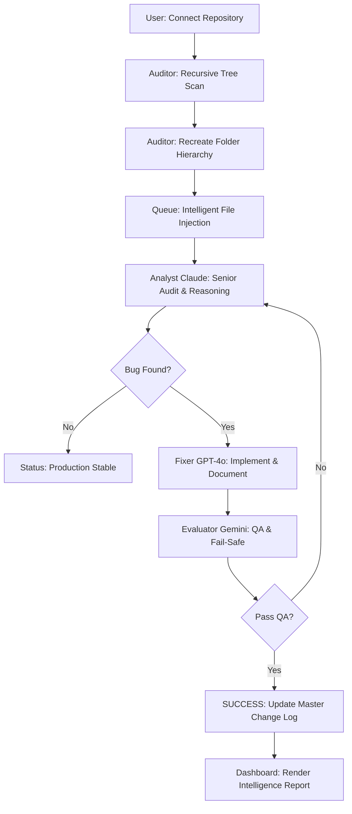

# 🔮 Agentic Auditor PRO v6.0
> **The Zero-Touch Production Auditor & Autonomous Repair Suite**

Agentic Auditor PRO is a state-of-the-art, multi-agent AI ecosystem designed to autonomously crawl, audit, and repair production-grade repositories. It combines the reasoning power of **Claude 3.5**, the precision of **GPT-4o**, and the evaluation speed of **Gemini** into a single, unified "Triple-Threat" orchestration.

---

## 🌟 Key Features (v6.0 Stable)

### 🏗️ Production-Grade Recursive Auditor
Unlike simple scanners, the Auditor performs a deep, recursive crawl of your entire GitHub tree. It recreates your **exact folder structure** locally, ensuring that complex projects with nested components (e.g., `/src/components/navbar/`) are audited with total structural integrity.

### 🧠 Senior Architect Intelligence Reports
The Agent doesn't just "silent-fix" code. Every modification includes an **Inline Intelligence Report**. Each fix is documented with:
- 🛠️ **The Problem**: Rationale for the change.
- 💡 **The Solution**: How the Senior Architect AI improved the logic.
- 🚀 **The Benefit**: Impact on security, performance, or stability.

---

## 🛠️ Engineering Decision: Why Antigravity?

In building a **Multi-Agent Code Quality System**, the choice of orchestration layer is critical. We chose **Antigravity** over traditional copilots or chat-based frameworks for three reasons:

1. **Autonomy vs. Interaction**: Most AI tools are designed as "Co-pilots" (human-in-the-loop). Antigravity is designed for **Autonomous Loops**. It provides the low-level primitives needed to build an agent that can plan 50 steps, recover from its own errors, and execute them without a human pressing "Tab."
2. **Deterministic Tool Use**: Production code review requires precise file system and terminal interaction. Antigravity’s tool-calling architecture allows our agents to perform deep recursive crawls and structural mirrors that standard LLM wrappers simply cannot handle.
3. **Multi-Model Orchestration**: Antigravity allows us to pipe the reasoning of **Claude 3.5**, the fixing precision of **GPT-4o**, and the evaluation speed of **Gemini** into a single cohesive stream. It acts as the "connective tissue" that enables our Triple-Threat architecture.

---

## 📊 System Workflow

The following diagram visualizes the autonomous loop of the **Agentic Auditor PRO**:



---

## 🧠 How it Works: The Engineering Detail

### 1. Structural Mirroring
The process begins with the **Auditor**. Instead of just downloading files, it performs a full directory traversal via the GitHub API. It recreates your project's exact folder structure in the local `./Project` workspace. This is critical for modern frameworks where imports are path-sensitive.

### 2. The Senior Audit Queue
Every discovered file (`.js`, `.jsx`, `.ts`, `.tsx`) is injected into a high-priority queue. The **Orchestrator** manages this queue, ensuring that files are processed sequentially to prevent context window collapse and manage token budgets effectively.

### 3. Multi-LLM Reasoning Loop
For every file, the system runs a 3-stage intelligence loop:
- **Phase A (Analysis)**: Claude 3.5 Sonnet identifies the "Why" and "Benefit" of a fix.
- **Phase B (Action)**: GPT-4o applies the fix and inserts inline `/** AI FIX */` comments.
- **Phase C (Validation)**: Gemini 1.5 Flash performs a high-speed QA check. If a fix fails, the "Error Feedback" is piped back into the loop for a re-try.

### 4. Intelligence Reporting
Once a file is fixed, the system updates the **Master Audit Change Log**. It doesn't just say "Fixed"; it retrieves the **Architect reasoning** from the Analyst and displays it on your dashboard, providing total transparency into the Agent's thought process.

---

The system operates using a specialized multi-agent pipeline where each AI model is assigned a role that matches its unique strengths.

### 🤖 1. The Auditor (Recursive Crawler)
- **Role**: Infrastructure & Discovery
- **Duty**: This agent performs a deep, recursive scan of your GitHub repository. It recreates your entire folder hierarchy locally and identifies every `.js`, `.jsx`, `.ts`, and `.tsx` file that needs a senior-level audit.

### 🤖 2. The Analyst (Powered by Claude 3.5 Sonnet)
- **Role**: Senior Software Architect
- **Duty**: The Analyst reads your code with a "Senior Architect" lens. It identifies security risks, memory leaks, and architectural anti-patterns.

### 🤖 3. The Fixer (Powered by GPT-4o)
- **Role**: Lead Developer
- **Duty**: Armed with the Analyst's report, the Fixer implements the actual code changes. It adds professional `/** AI FIX: ... */` documentation directly into your source code.

### 🤖 4. The Evaluator (Powered by Gemini 1.5 Flash)
- **Role**: QA Engineer & Fail-Safe
- **Duty**: The Evaluator reviews the final output. If the AI service encounters an error, it triggers a "Re-thinking" loop or switches to a local stable fallback.

---

## 🔄 The Autonomous Workflow
1. **Connect**: The user enters a GitHub URL.
2. **Crawl**: The **Auditor** builds a local mirror of the repository.
3. **Analyze**: The **Analyst** identifies improvements and generates a strategy.
4. **Repair**: The **Fixer** writes the documented code.
5. **Validate**: The **Evaluator** confirms the fix is production-ready.
6. **Report**: The **Master Change Log** updates the user on the dashboard.

---

## 🛠️ Technology Stack
- **Core**: TypeScript, Node.js (tsx)
- **Backend**: Express.js (High-performance telemetry API)
- **Frontend**: Vite + Vanilla JS (Glassmorphism Dashboard)
- **AI Orchestration**: Antigravity

---

## 🚀 Getting Started

### 1. Prerequisites
- Node.js (v18+)
- GitHub Personal Access Token (PAT)
- API Keys for Claude, GPT, or Gemini

### 2. Installation
```bash
git clone https://github.com/faisalhasan00/Grabons-Task.git
cd Grabons-Task
npm install
```

### 3. Configuration
Create a `.env` file in the root directory:
```env
GEMINI_API_KEY=your_key
TARGET_REPO=./Project
PORT=3000
```

### 4. Running the System
**Terminal 1 (Backend Agent):**
```bash
npm start
```

**Terminal 2 (Frontend Dashboard):**
```bash
cd frontend
npm run dev
```

---

## 📡 Usage
1. Open [http://127.0.0.1:5173](http://127.0.0.1:5173).
2. Enter your GitHub repository URL (e.g., `user/repo`).
3. Click **"Connect & Auto-Fix"**.
4. Watch the **Master Change Log** as the Agent repairs your repository in real-time.
